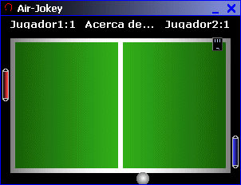

<div align="center">

## \[Air\-Jokey\]


</div>

### Description

A cool Pong game with sounds. You can play with the computer or another user. It game use Birblt. Y vamos Argentina!!!
 
### More Info
 
-Move a object with the mouse.

-Use the arrows (keyboard)

-Move a ball qith Bitblt and do it bounce with Do-Loop

-Make your own windows style


<span>             |<span>
---                |---
**Submitted On**   |2002-12-17 18:31:26
**By**             |[ Alvaro](https://github.com/Planet-Source-Code/PSCIndex/blob/master/ByAuthor/alvaro.md)
**Level**          |Intermediate
**User Rating**    |4.2 (38 globes from 9 users)
**Compatibility**  |VB 6\.0
**Category**       |[Games](https://github.com/Planet-Source-Code/PSCIndex/blob/master/ByCategory/games__1-38.md)
**World**          |[Visual Basic](https://github.com/Planet-Source-Code/PSCIndex/blob/master/ByWorld/visual-basic.md)
**Archive File**   |[\[Air\-Jokey15150812172002\.zip](https://github.com/Planet-Source-Code/alvaro-air-jokey__1-41673/archive/master.zip)

### API Declarations

```
BitBlt
And more
```


